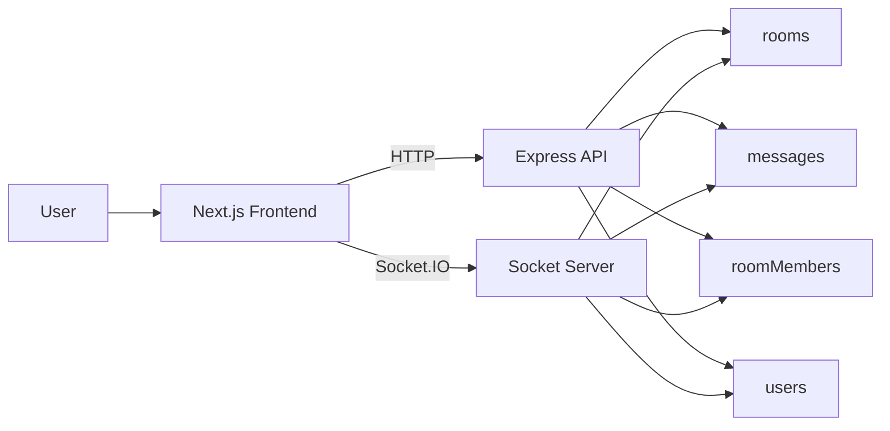
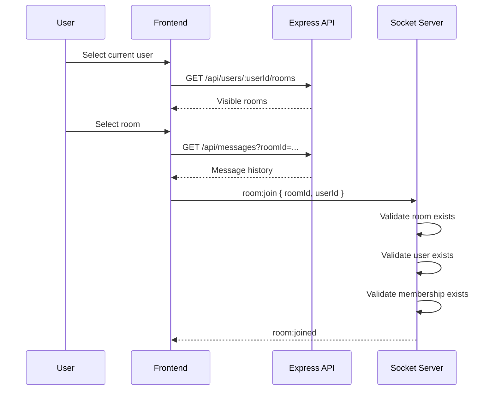
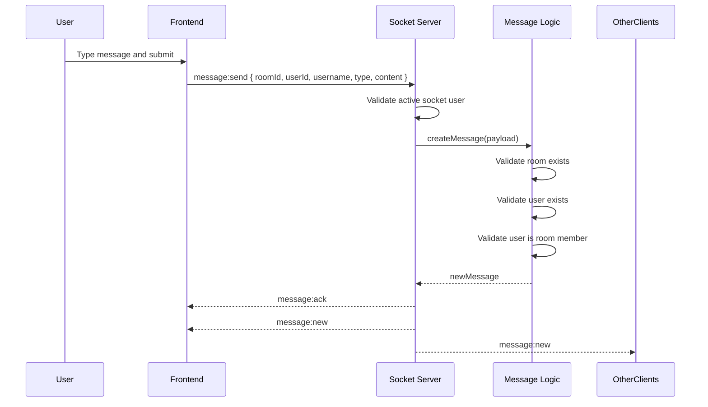
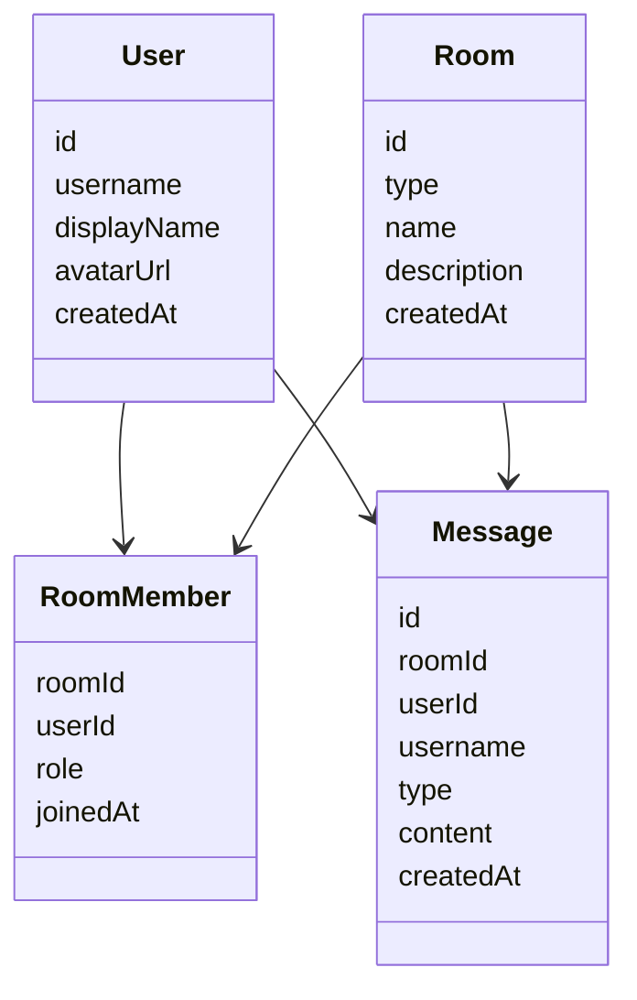

# Chat Logic

## Overview

LiHoChat currently uses:

- `Next.js` frontend for room selection, message rendering, and user switching
- `Express` API for loading users, rooms, members, and message history
- `Socket.IO` for room join and real-time message delivery

The chat model is built around four core data structures:

- `users`
- `rooms`
- `roomMembers`
- `messages`

`rooms` support two types:

- `group`
- `direct`

Both types use the same message flow. The difference is only in room membership and presentation.

## System Diagram

## Room Access Flow

## Send Message Flow

## Data Model

## API and Socket Responsibilities

- `GET /api/users`
  - Returns available users for the frontend selector
- `GET /api/users/:userId/rooms`
  - Returns only rooms visible to that user
- `GET /api/messages?roomId=...`
  - Returns message history for one room
- `GET /api/rooms/:roomId/members`
  - Returns expanded room member profiles

- `room:join`
  - Joins one socket connection to one room after membership validation
- `message:send`
  - Creates a new message after room, user, and membership validation
- `message:ack`
  - Confirms message creation to the sender
- `message:new`
  - Broadcasts the created message to all connected room members

## Validation Rules

Before a message is created, the backend verifies:

1. The room exists
2. The user exists
3. The user belongs to the room
4. The socket user matches the message sender

This keeps the `direct` and `group` chat models consistent under the same flow.
